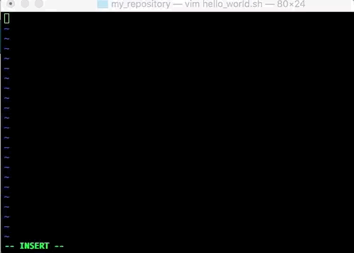
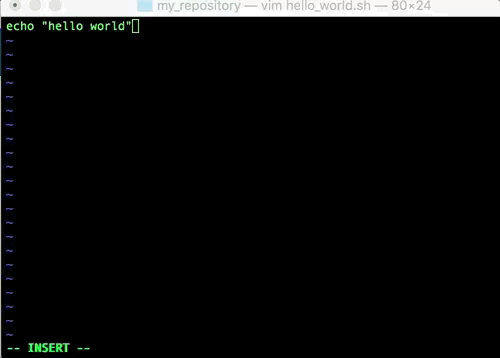

# VIM

Full documentation: https://vim.sourceforge.io/docs.php  

Create a file and open it in a vim editor  
```bash
vim hello_world.sh
```

# Commands Table of Contents
- [Inserting and Deleting text](#inserting-and-deleting-text)
- [Saving Changes & Quit](#saving-changes-and-exit)
- [Challenge](#challenge)
---

## Inserting and Deleting text
 
Press `ESC` + `I`, then type the text. 

You can use `backspace` or `delete` to delete a text.  



## Saving Changes and Exit

Press `ESC` + `:` + `w`, hit `Enter` to save  
Press `ESC` + `:` + `q`, hit `Enter` to exit  
__OR__
Press `ESC` + `:` + `wq`, hit `Enter` to save and then exit  



## Challenge!

Create a .vimrc file in your HOME directory and the following content.  

```
set paste

filetype plugin indent on
" show existing tab with 4 spaces width
set tabstop=4
" when indenting with '>', use 4 spaces width
set shiftwidth=4
" On pressing tab, insert 4 spaces
set expandtab

syntax on
let &t_Co=256
```

__HINTS:__ 
- use `vim $HOME/.vimrc` to create and open the file. 
- `Shift` + `Insert`, to paste a copied text.  